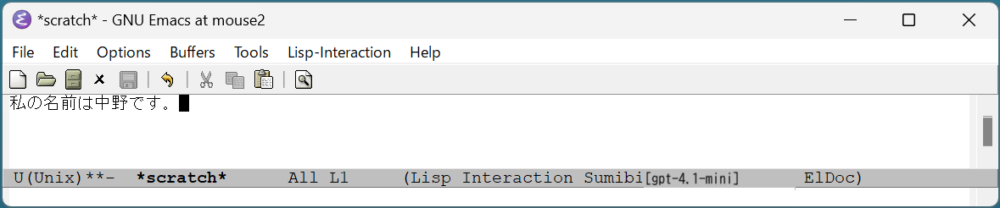

# FAQ よくある質問

## Q. Sumibiの特徴は？

A. モードレスの日本語変換システムです。

WindowsやmacOSの標準の日本語入力システムは、日本語入力モードのオンとオフを切り替える必要がありますが、
Sumibiはどのような場面であっても、Ctrl-Jキーを押すと直前のローマ字の文章を日本語に変換します。

## Q. どのOSで利用できますか？

A. Windows/Linux/macOSのどれでも動作します。

## Q. 対応しているEmacsバージョンは？

A. Emacs 28.x 以上に対応しています。

## Q. Emacsの他に必要なソフトウェアはありますか？

A. いいえ、必要ありません。

## Q. OpenAIのアカウントは必要ですか？

A. はい、必要です。OpenAI APIの契約をしてAPIキーを取得してください。

## Q. Sumibiを使うとOpen AIに支払う費用はどれくらいかかりますか？

A. gpt-3.5-turboモデルを使った場合、1ドキュメントを書くのに約1円から5円程度です。
Sumibiの設定をgpt-4モデルに変更して日本語のドキュメントを書くと、大体20倍から30倍の費用がかかります。
普段はGPT-4モデルを利用して、長文を翻訳する時はGPT-3.5-Turboに切り替える運用がおすすめです。

1. 例えば、ブログ記事[Generative AI Space and the Mental Imagery of Alien Minds](https://writings.stephenwolfram.com/2023/07/generative-ai-space-and-the-mental-imagery-of-alien-minds/)を翻訳した時の実績値を掲載します。

- gpt-3.5-turboで翻訳するとだいたい10円程度かかりました。
- gpt-4に変更して、翻訳するとだいたい300円程度かかりました。

2. 以下、OpenAIの料金表です。

[Pricing](https://openai.com/pricing)
| Model | Input | Output |
| ----- | ----- | ------ |
| GPT-3.5 Turbo 4K context | $0.0015 / 1K tokens | $0.002 / 1K tokens |
| GPT-4 8K context | $0.03 / 1K tokens | $0.06 / 1K tokens |

## Q. 期待した漢字が出ません。うまく変換するやり方はありますか？

A. なるべく長い文書を入力してから変換するのがコツです。

また、思った漢字が出なかった場合は、間違った漢字の部分を範囲選択した上でCtrl-Jキーを押すと同音異議語を表示します。
Sumibiバージョン2.0以降では、Emacs Lispのローカルに持っている同音異議語辞書を持っているので、豊富な変換候補を提案してくれます。

## Q. 漢字ではなくひらがなやカタカナで書きたい単語があります。どうすれば良いですか？

ひらがなや漢字の単語を範囲選択した上でCtrl-Jキーを押すと、ひらがなとカタカナが出力されます。

## Q. 変換精度を上げる方法はありますか？

2025年4月の最新のgpt-4.1でも満足できない場合は、それ以降に発表された、より性能の高いモデルに変更してください。

## Q. GPTを使っているなら、英語から日本語への翻訳もできそうです。どのようにしたら翻訳できますか？

A. ローマ字の文章の代わりに、英語の文章の最後でCtrl-Jを入力すると日本語に翻訳できます。また、英語の文章が何行にもなる場合は、複数行を範囲指定してCtrl-Jを押すことで翻訳できます。

## Q. GPTを使っているなら、長文の要約もできそうです。どのようにすれば要約ができますか？

A. Sumibi Ver 2.x では、まだ長文の要約をサポートしていません。将来バージョンでサポート予定です。

## Q. OpenAIからの応答が長い場合が待てません。タイムアウトを短くすることはできますか？

A. はい、カスタマイズ変数 sumibi-api-timeout を60秒から変更してください。逆に長い文章を翻訳することが多い方は、60秒から300秒などに変更するのもおすすめです。

## Q. gpt-4.1-mini 以外のモデルを利用したいのですが、どのようにすれば良いですか？

A. カスタマイズ変数 sumibi-current-model を "gpt-4.1" などに変更してください。
