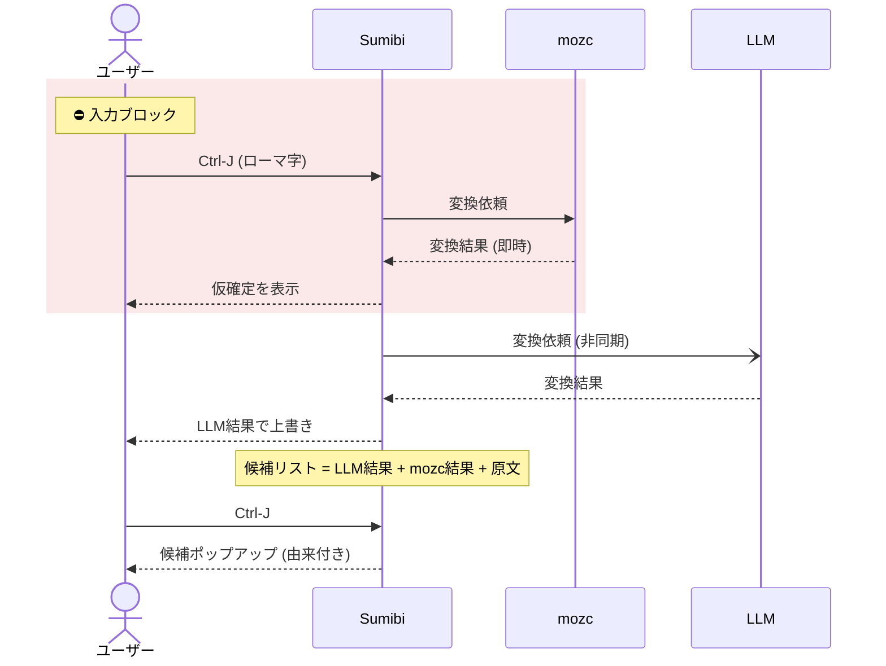

# mozc仮確定（二段階変換）

## mozc仮確定とは

SumibiのLLM変換は精度が高い反面、ネットワーク往復を伴うため、Ctrl+Jを押してから結果が表示されるまでに数百ミリ秒〜数秒の待ち時間が発生します。

mozc仮確定は、この待ち時間を体感的に解消する二段階変換（プログレッシブ変換）機能です。ローカルで動作するmozc（mozc_emacs_helper）によるかな漢字変換を先に走らせて「仮確定」として即座に表示し、LLM変換が完了したらその結果で上書きします。LLMを待たずに入力を続けて仮確定をmozcの結果で確定してしまった場合も、後から完了したLLMの結果は候補として保持され、`Ctrl+J` で選び直せます。

```
[Ctrl+J / アンビエント変換のトリガー]
        │
        ├─(即時) mozcのかな漢字変換結果を「仮確定」として表示
        │        （グレー・下線付きのオーバーレイ表示）
        │
        └─(非同期) 従来通りLLMへ
                 └─ 完了 ─┬─ 仮確定のまま → LLMの結果で上書き
                          └─ 早期確定済み → LLMの結果を候補リストに追加
                                            （Ctrl+Jで選び直せる）
```

シーケンス図で見ると次のようになります。赤い枠内だけキー入力がブロックされます（mozcはローカル変換のため数ms）。枠の外はいつでも入力を続けられ、LLM完了前に入力すると仮確定はmozc結果で確定し、LLM結果は候補に回ります。



## 動作イメージ

1. `honjitsuhaseitennari` と入力して `Ctrl+J`
2. 即座にmozcの変換結果（例: `本日は晴天なり`）がグレー・下線付きで仮確定表示される
3. LLM変換が完了すると、仮確定がLLMの結果で置き換わり通常の表示になる

アンビエント変換（`sumibi-ambient-enable`）の助詞・句読点トリガーにも同様に適用されます。

## 設定方法

init.elに以下を追加してください。

```elisp
(setq sumibi-mozc-provisional-enable t)
```

本機能には `mozc_emacs_helper` コマンドが必要です。見つからない場合は一度だけメッセージで通知され、従来通りの同期変換で動作します（エラーにはなりません）。

## mozc_emacs_helper のインストール

| 環境 | インストール方法 |
|---|---|
| Debian / Ubuntu | `sudo apt install emacs-mozc-bin` |
| Fedora | `sudo dnf install mozc` |
| macOS | [google/mozc](https://github.com/google/mozc) をソースからビルド |

PATH上の `mozc_emacs_helper` に加えて、各プラットフォームの標準的なインストール先（`/usr/lib/mozc/`、`/usr/lib64/mozc/`、`/opt/homebrew/`、`/usr/local/` 等）を自動探索します。見つからない場合は、パスを明示的に指定してください。

```elisp
(setq sumibi-mozc-helper-path "/path/to/mozc_emacs_helper")
```

## 仮確定中の操作

仮確定が表示されている間（LLM変換の完了待ちの間）は、以下の操作ができます。

| 操作 | 動作 |
|---|---|
| そのまま待つ | LLM変換の完了と同時に、高精度な結果に置き換わる |
| 続けて次のローマ字を入力 | 仮確定がmozcの結果で即確定し、入力を続けられる |
| 変換直後にもう一度 `Ctrl+J` | 仮確定がmozcの結果で即確定する（候補選択には入らない） |
| 仮確定の領域を編集する | LLMの結果による上書きはキャンセルされる（編集内容を優先） |

「続けて次のローマ字を入力」した場合と「仮確定の領域を編集」した場合は、後から完了したLLMの結果で上書きされることはありません。入力のリズムを優先したいときは、仮確定を見た時点でどんどん入力を続けられます。

なお、mozcの結果で早期確定した後もLLMの結果は捨てられません。LLM変換が完了すると候補として保持され、確定文字列にカーソルを合わせて `Ctrl+J` を押すことで「mozcの確定結果 → LLMの結果 → 原文」の順で並んだ候補から選び直せます。一方、仮確定の領域を手で編集した場合は、編集内容を優先するためLLMの結果は破棄されます（候補にも残りません）。

**例**: `dhisutoribyu-son` と入力 → 仮確定「ディストリビュー村」→ 次の入力で早期確定 → その後LLMが完了 → 確定文字列上で `Ctrl+J` → 候補「ディストリビュー村（mozc）/ ディストリビューション（LLM）/ 原文まま」から選択

## LLM失敗時のフォールバック

LLM変換が失敗・タイムアウトした場合は、mozcの変換結果がそのまま実テキストとして確定します（ローマ字には戻りません）。ネットワークが不安定な環境でも、ローカルの高速な変換がフォールバックとして機能するため、入力のリズムが途切れません。

## 候補選択との関係

LLMの結果で確定した後に `Ctrl+J` を押すと、従来通り候補選択のポップアップが開きます。このとき第二候補にmozcの変換結果が差し込まれるため、LLMの結果が気に入らない場合はすぐにmozcの結果を選べます。

逆に、mozcの結果で早期確定した場合は、第1候補がmozcの確定結果、第2候補が後から完了したLLMの結果になります。どちらで確定しても、もう一方の結果を候補からすぐに選び直せます。

候補の注釈には由来が表示されるため、どの候補がmozc由来・LLM由来かひと目で分かります。

```
ディストリビュー村        ; mozc candidate 1
ディストリビューション    ; LLM candidate 2
dhisutoribyu-son          ; 原文まま
```

## 対象外となる入力

以下の入力は仮確定の対象外で、従来通りの同期変換で処理されます。

- 漢字を含むテキストの再変換
- 日本語から英語への逆変換
- 助詞など固定変換キーワード（`ha` `ga` 等の単独変換）

## カスタマイズ変数

| 変数 | デフォルト | 説明 |
|---|---|---|
| `sumibi-mozc-provisional-enable` | `nil` | 本機能の有効/無効 |
| `sumibi-mozc-helper-path` | `nil`（自動探索） | `mozc_emacs_helper` のパス |
| `sumibi-mozc-timeout` | `1.0` | mozcの応答待ちタイムアウト秒数 |
| `sumibi-mozc-provisional-face` | グレー・下線 | 仮確定テキストの表示face |

表示を変えたい場合の例:

```elisp
(set-face-attribute 'sumibi-mozc-provisional-face nil
                    :foreground "dark cyan" :underline t)
```
