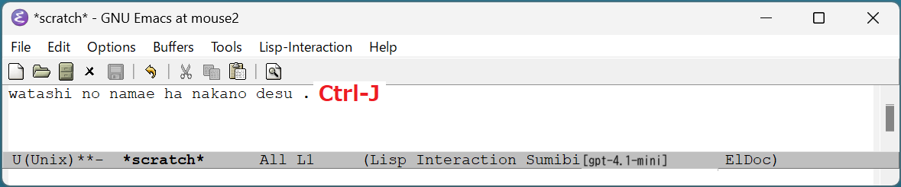
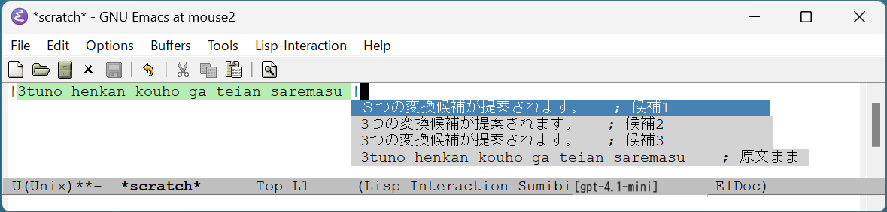
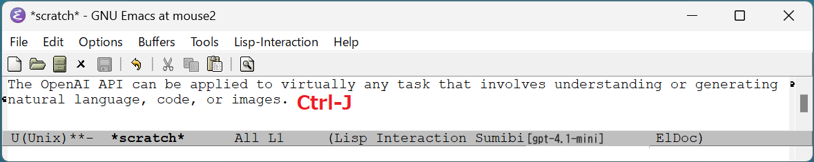

# Sumibi

Japanese input method powered by ChatGPT API


## Sumibiとは

Emacs用の日本語入力システム(IME)です。

Sumibiはモードレスです。
日本語入力モードに切り替えることなく日本語を入力できます。

日本語と英語の相互翻訳もサポートしていますので、英語で文章を書くことが多い人にもおすすめです。

よくある質問はこちら。[FAQ](FAQ.md)

## 利用可能なEmacsバージョン

Emacs version 28.x (Windows/Linux/macOS) で動作します。Emacs以外の追加ソフトウェアは不要です。

## Emacsクライアントのインストール

1. OpenAI AIのサブスクリプションを契約します。

[https://platform.openai.com/account/api-keys](https://platform.openai.com/account/api-keys)


2. 環境変数 OPENAI\_API\_KEY にOpenAPIのAPIキーを登録します。
3. melpa から以下のパッケージをインストールします。

```
popup 0.5.9
unicode-escapeo 20230109.1222
deferred 20170901.1330
```

4. sumibi.el を \~/.emacs.d/ に保存します。
5. \~/.emacs.d/init.el に以下のコードを追加します。

```lisp
(require 'sumibi)
(global-sumibi-mode 1)
```

## インストールが成功したかどうかの確認方法

Emacsを再起動するとSumibiがステータスバーに表示されます。
[gpt-3.5-turbo] はOpenAI API 呼び出しで使用しているGPTのモデルです。


## ローマ字や英語の文章から日本語への変換

1. ローマ字で書いた文章の最後にカーソルを合わせて、Ctrl-J を入力すると日本語の文章に置き換わります。
    
    
2. 変換結果が気に入らない場合は、そのまま Ctrl-J を入力すると変換候補のポップアップが表示されるので、その中から選択できます。
    

3. 英語の文章の最後にカーソルを合わせて、Ctrl-J を入力すると、日本語の文章に変換されます。
    
    


## 日本語から英語への翻訳

日本語の文章をregion選択した状態で、ESC を押してから j を入力すると、英語に翻訳されます。

「ESC を押してから j」は、代わりに ALT+j でも入力可能です。

## Undo

変換結果が気に入らない時は、ESC-u キーを入力することでUndoできます。

または、変換結果に原文ままの選択肢がありますので「原文まま」を選択します。


# History

### Ver 1.0.0

* ファーストリリース

### Ver 1.1.0

* region指定した状態でCtrl-J文字入力すると読み(ひらがな・カタカナ)と同音異議語を成成できるようにした。
* OpenAI API呼び出しのタイムアウトエラーを実装した。
* 入力した文章にダブルクオーテーションや改行が入っていると変換エラーとなるバグを修正した。
* 「nn」を「ん」として認識してくれないのでプロンプト特別な依頼事項として記載した。

### Ver 1.2.0

* OSSの名前をSumibiGPTからSumibiに変更した。
* sumibigpt.elをsumibi.elに変更した。
* 英語への翻訳機能を実装した。

### Ver 1.3.0

* markdown形式的な英語のドキュメントを一括で翻訳する際、以下のmarkdown syntaxが壊れないように対策した。(nameとsentenceの部分だけが日本語に翻訳される)

```
[name](URL)

# sentence
## sentence
### sentence
#### sentence
```

### Ver 1.4.0

* 100文字を超える文章を長文と判断して、バックグラウンドで漢字変換するようにした。
(カスタマイズ編集 _sumibi-threshold-letters-of-long-sentence_ で変更可能)
* バックグラウンドでの漢字変換や翻訳を並行で実行できるようにした。

