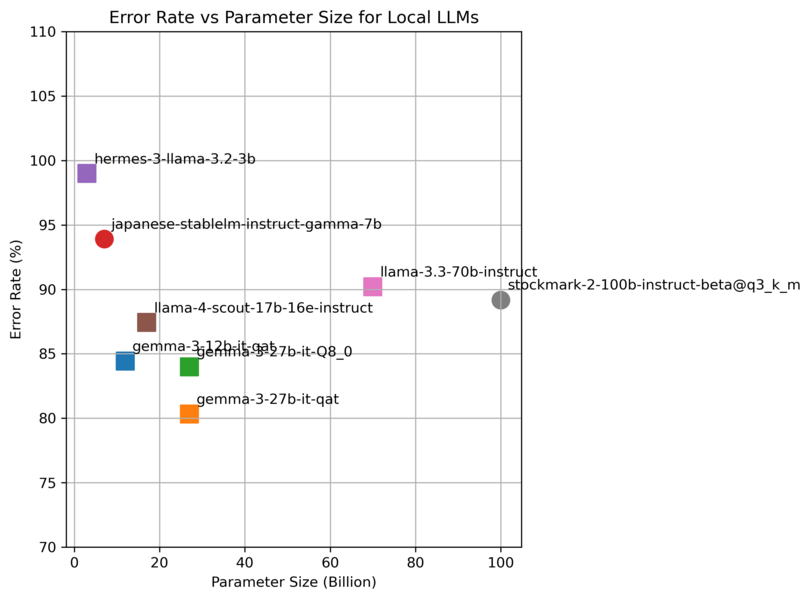

<!--
benchmark ディレクトリの README
各モデルのベンチマーク結果（平均応答時間・文字誤り率）をまとめ、傾向分析を行った内容を記載しています。
-->
# ベンチマーク結果まとめ

このディレクトリには、Sumibi クライアントを用いて取得した各モデルの応答時間および文字誤り率（CER: Character Error Rate）を集計・可視化するスクリプトと測定結果が含まれています。なお、Sumibiはローマ字かな漢字変換という性質上、応答時間が約1秒を超えるとユーザビリティが低下します。そのため、応答時間の長いモデルは実用面で不利であり、評価においても高く評価されにくい点に留意してください。

## ディレクトリ構成
- `sumibi_bench.py` / `sumibi_typical_convert_client.py`: ベンチマーク実行用スクリプト
- `aggregate_results.py`: JSON 形式の結果を統合し、CSV に出力するスクリプト
- `plot_mean_response_time.py`: 各モデルの平均応答時間を横長バー＋エラー率折れ線でプロット
- `plot_errorrate_vs_cost.py`: 文字誤り率と API コストの関係をプロット
- `plot_errorrate_vs_paramsize.py`: 文字誤り率とモデルパラメータ数の関係をプロット
- `result/`: 各モデルのベンチマーク結果 JSON ファイル

## Chat Completion API 呼び出し内容

ベンチマークでは、`sumibi_typical_convert_client.py` 内で以下の Chat Completion API 呼び出しを行っています:

```python
response = self.client.chat.completions.create(
    model=モデル名,
    temperature=0.8,
    n=1,
    messages=messages,
)
```

### プロンプト (`messages`) の内容(Sumibi ver2.3.0)

| role      | content |
|-----------|---------|
| system    | あなたはローマ字とひらがなを日本語に変換するアシスタントです。ローマ字の 「nn」 は 「ん」と読んでください。\[\]\(URL\)のようなmarkdown構文は維持してください。\# や \#\# や \#\#\# や \#\#\#\# のようなmarkdown構文は維持してください。  |
| user      | ローマ字とひらがなの文を漢字仮名混じり文にしてください。 周辺の文章は、「こんにちは、中野です。watashi no namae ha nakano desu . どうぞよろしくお願いします。」のような文章になっています。周辺の文脈を見てそれに合った語彙を選んでください。: watashi no namae ha nakano desu . |
| assistant | 私の名前は中野です。 |
| user      | ローマ字とひらがなの文を漢字仮名混じり文にしてください。周辺の文章は、「説明はここまでです。それ以外は ikano toori desu .」のような文章になっています。周辺の文脈を見てそれに合った語彙を選んでください。: ikano toori desu . |
| assistant | 以下の通りです。 |
| user      | ローマ字とひらがなの文を漢字仮名混じり文にしてください。 周辺の文章は、「{**surrounding_text**}」のような文章になっています。 周辺の文脈を見てそれに合った語彙を選んでください。: {**text**} |

※ **surrounding_text** 部分には「増えたkotode,onnjowuwotorimodoshi,」のような変換対象の周辺文章を含む文字列が埋め込まれて実行されます。
※ **text**部分には「kotode,onnjowuwotorimodoshi,」のような変換対象の文字列が埋め込まれて実行されます。

### プロンプト (`messages`) の内容(Sumibi ver2.4.0追加部分)

※ 以下の**太字**の部分を追加しました。これにより変換エラー率が下がりました。

| role   | content                                                                                                                                                                                                                                                                                                                                         |   |
|--------|-------------------------------------------------------------------------------------------------------------------------------------------------------------------------------------------------------------------------------------------------------------------------------------------------------------------------------------------------|---|
| system | あなたはローマ字とひらがなを日本語に変換するアシスタントです。ローマ字の 「nn」 は 「ん」と読んでください。\[\]\(URL\)のようなmarkdown構文は維持してください。\# や \#\# や \#\#\# や \#\#\#\# のようなmarkdown構文は維持してください。**ローマ字の字面をそのままひらがなや漢字にするだけで、元のローマ字にない文章を作り出さないでください。出力は変換後の一文のみ。注釈や説明は一切付けないください。もし、入力された文章が英語の文章と判断できた場合は、日本語に翻訳してください。** |

## 測定結果グラフ


## 傾向分析
Sumibi のユーザビリティを左右する主要因として、以下の3つの観点が重要です。
1. レイテンシー（応答時間）
2. 文字誤り率（CER: Character Error Rate）
3. API 利用コスト（$/リクエスト）

以下ではこれらを組み合わせた傾向を分析します。

### レイテンシーと精度のトレードオフでの評価
ver **2.4.0** での代表値（平均応答時間 / CER / コスト）は次のとおりです。

- **1 秒未満でバランス良好**  \
  - `gemini-2.0-flash`：**0.61 s / 19.3 % / $0.00013** ─ 最速級で低コスト。  \
  - `gpt-4o`：**0.98 s / 13.0 % / $0.00550** ─ 高精度だが高価。  \

- **1 秒未満だがトレードオフあり**  \
  - `gemini-2.0-flash-lite`：0.59 s / 32.2 % / $0.0000975 ─ 最安だが精度は控えめ。  \
  - `gpt-3.5-turbo`：0.83 s / 64.5 % / $0.00055 ─ 高速だが誤り率が高い。  \
  - `gpt-4.1-mini`：0.98 s / 30.8 % / $0.00052 ─ 中コスト・中精度。  \
  - `gpt-4o-mini`：1.06 s / 51.5 % / $0.000195 ─ 低価格だが精度が課題。  \

- **1 秒以上で実用性が落ちる**  \
  - `gpt-4.1`：1.28 s / 11.7 % / $0.00260 ─ 高精度だが 1 s を超える。  \
  - `gemini-2.5-flash-preview-04-17`：4.18 s / 8.9 % / $0.000195 ─ 超高精度だが遅延大。  \
  - `deepseek-v3`：5.14 s / 29.6 % / $0.000355 ─ 低コストだが遅い。  \
  - `o4-mini`：14.31 s / 19.6 % / $0.00143 ─ レイテンシー面で不向き。  \
  - `gemini-2.5-pro-preview-05-06`：17.67 s / 6.2 % / $0.002625 ─ 最高精度だが非常に遅い。  \

### コスト面の評価
- **コスト最優先で実用的**  \
  - `gemini-2.0-flash-lite`：**$0.0000975** — 0.59 s / CER 32 %。最安値。  \
  - `gemini-2.0-flash`：**$0.00013** — 0.61 s / CER 19 %。速度・精度とも実用域。  \

- **精度重視で許容できるコスト**  \
  - `gemini-2.5-flash-preview-04-17`：$0.000195 — CER 8.9 ％。遅延 4 s を許容できれば高コスパ。  \
  - `gpt-4.1`：$0.00260 — CER 11.7 ％、1.3 s。やや高価だが高精度。  \

- **最高性能だが高コスト**  \
  - `gpt-4o`：$0.00550 — CER 13 ％、0.98 s。速度と精度は申し分ないがコストが最も高い。  \

### 総合評価
コストを重視しつつ速度と精度のバランスを取るなら、`gemini-2.0-flash` が最適です。  
より高い精度を求めコストを許容できる場合は、`gpt-4.1` を次点として推奨します。

## ベンチマーク環境の構築手順

1. Sumibiのリポジトリをgit cloneする

```bash
   git clone git@github.com:kiyoka/Sumibi.git
```
2. https://github.com/azooKey/AJIMEE-Bench のソースコード一式をダウンロードする

3. ./Sumibi/benchmarkAJIMEE-Benchにダウンロードしたソースコード一式を展開する

## 実行手順
1. ベンチマーク実行 ( google のgemini-2.0-flashのベンチマークデータ取得の例)
   ```bash
   export SUMIBI_AI_API_KEY="AIxxxxxxxxxxxxxxxxxxxxxxxxxxxxxxxxxxx"
   export SUMIBI_AI_BASEURL=https://generativelanguage.googleapis.com/v1beta/openai/
   export SUMIBI_AI_MODEL=gemini-2.5-flash-preview-04-17   
   make result/gemini-2.0-flash.json
   ```  

2. 結果集計
   ```bash
   make aggregate 
   ```  
   
3. プロット生成
   ```bash
   make plots
   ```
# ローカルLLM
ローカルLLMでもベンチマークデータを取得しました。100B(1000億パラメータ)までのモデルを試しましたが、実用的に使えるモデルはありませんでした。一般的なPCやクラウドで借りれるGPUサーバーで稼働できるモデルにも予算面で限界があるため、Sumibiには適していないことが分かります。Sumibiは各種ビッグテックのAPI経由で利用することが最も現実的です。
また、100Bサイズのパラメータまでの範囲では、パラメータサイズを大きくしても変換精度向上はほとんど見られませんでした。ローマ字をすべてカタカナにしてもほとんどエラー率は下がらなかったため、ローマ字を読む能力が低いというわけでもなさそうです。パラメータ数が少なくても日本語の性能が良いというモデルが出てきたら、追試します。



# ローカルLLMの実行環境

- GPU-16GByte RAMに収まる場合、 AWS g6.xlarge 使用 ( USD 1.3512:Windows/Tokyo region)
- GPU 48GByte RAMに拡張したい場合、AWS g6e.2xlarge 使用 ( USD 3.61968:Windows/Tokyo region)

### 利用するEC2インスタンスタイプ

| インスタンス名     | vCPU | メモリ (GiB) | NVIDIA L4 Tensor Core GPU | GPU メモリ (GiB) | ネットワーク帯域幅 (Gbps) | EBS 帯域幅 (Gbps) |
|-------------------|------|--------------|--------------------------|------------------|--------------------------|-------------------|
| **g6.xlarge**     | 4    | 16           | 1                        | 24               | 最大 10                  | 最大 5            |
| g6.2xlarge        | 8    | 32           | 1                        | 24               | 最大 10                  | 最大 5            |
| g6.4xlarge        | 16   | 64           | 1                        | 24               | 最大 25                  | 8                 |
| g6.8xlarge        | 32   | 128          | 1                        | 24               | 25                       | 16                |
| g6.16xlarge       | 64   | 256          | 1                        | 24               | 25                       | 20                |
| g6.12xlarge       | 48   | 192          | 4                        | 96               | 40                       | 20                |
| g6.24xlarge       | 96   | 384          | 4                        | 96               | 50                       | 30                |
| g6.48xlarge       | 192  | 768          | 8                        | 192              | 100                      | 60                |

| インスタンス名      | vCPU | メモリ (GiB) | NVIDIA L40S GPU | GPU メモリ (GB) | ネットワーク帯域幅 (Gbps) | EBS 帯域幅 (Gbps) |
|------------------|------|--------------|------------------|------------------|---------------------------|-------------------|
| g6e.xlarge       | 4    | 32           | 1                | 48               | 最大 20                   | 最大 5            |
| **g6e.2xlarge**  | 8    | 64           | 1                | 48               | 最大 20                   | 最大 5            |
| g6e.4xlarge      | 16   | 128          | 1                | 48               | 20                        | 8                 |
| g6e.8xlarge      | 32   | 256          | 1                | 48               | 25                        | 16                |
| g6e.16xlarge     | 64   | 512          | 1                | 48               | 35                        | 20                |
| g6e.12xlarge     | 48   | 384          | 4                | 192              | 100                       | 20                |
| g6e.24xlarge     | 96   | 768          | 4                | 192              | 200                       | 30                |
| g6e.48xlarge     | 192  | 1,536        | 8                | 384              | 400                       | 60                |
