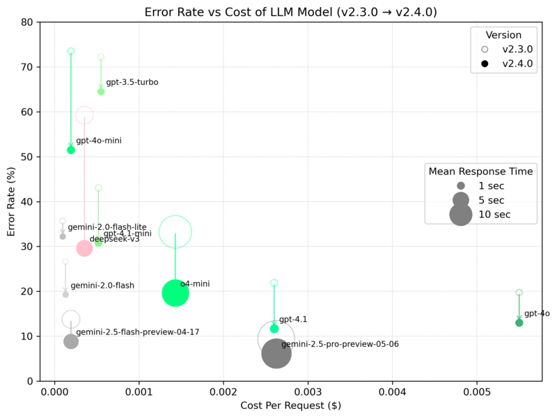

<!--
benchmark ディレクトリの README
各モデルのベンチマーク結果（平均応答時間・文字誤り率）をまとめ、傾向分析を行った内容を記載しています。
-->
# ベンチマーク結果まとめ

このディレクトリには、Sumibi クライアントを用いて取得した各モデルの応答時間および文字誤り率（CER: Character Error Rate）を集計・可視化するスクリプトと測定結果が含まれています。なお、Sumibiはローマ字かな漢字変換という性質上、応答時間が約1秒を超えるとユーザビリティが低下します。そのため、応答時間の長いモデルは実用面で不利であり、評価においても高く評価されにくい点に留意してください。

## ディレクトリ構成
- `sumibi_bench.py` / `sumibi_typical_convert_client.py`: ベンチマーク実行用スクリプト
- `aggregate_results.py`: JSON 形式の結果を統合し、CSV に出力するスクリプト
- `plot_mean_response_time.py`: 各モデルの平均応答時間を横長バー＋エラー率折れ線でプロット
- `plot_errorrate_vs_cost.py`: 文字誤り率と API コストの関係をプロット
- `plot_errorrate_vs_paramsize.py`: 文字誤り率とモデルパラメータ数の関係をプロット
- `result/`: 各モデルのベンチマーク結果 JSON ファイル

## Chat Completion API 呼び出し内容

ベンチマークでは、`sumibi_typical_convert_client.py` 内で以下の Chat Completion API 呼び出しを行っています:

```python
response = self.client.chat.completions.create(
    model=モデル名,
    temperature=0.8,
    n=1,
    messages=messages,
)
```

### プロンプト (`messages`) の内容

| role      | content |
|-----------|---------|
| system    | あなたはローマ字とひらがなを日本語に変換するアシスタントです。ローマ字の 「nn」 は 「ん」と読んでください。\[\]\(URL\)のようなmarkdown構文は維持してください。\# や \#\# や \#\#\# や \#\#\#\# のようなmarkdown構文は維持してください。  |
| user      | ローマ字とひらがなの文を漢字仮名混じり文にしてください。 周辺の文章は、「こんにちは、中野です。watashi no namae ha nakano desu . どうぞよろしくお願いします。」のような文章になっています。周辺の文脈を見てそれに合った語彙を選んでください。: watashi no namae ha nakano desu . |
| assistant | 私の名前は中野です。 |
| user      | ローマ字とひらがなの文を漢字仮名混じり文にしてください。周辺の文章は、「説明はここまでです。それ以外は ikano toori desu .」のような文章になっています。周辺の文脈を見てそれに合った語彙を選んでください。: ikano toori desu . |
| assistant | 以下の通りです。 |
| user      | ローマ字とひらがなの文を漢字仮名混じり文にしてください。 周辺の文章は、「{**surrounding_text**}」のような文章になっています。 周辺の文脈を見てそれに合った語彙を選んでください。: {**text**} |

※ **surrounding_text** 部分には「増えたkotode,onnjowuwotorimodoshi,」のような変換対象の周辺文章を含む文字列が埋め込まれて実行されます。
※ **text**部分には「kotode,onnjowuwotorimodoshi,」のような変換対象の文字列が埋め込まれて実行されます。

## 測定結果グラフ





## 傾向分析
Sumibi のユーザビリティを左右する主要因として、以下の3つの観点が重要です。
1. レイテンシー（応答時間）
2. 文字誤り率（CER: Character Error Rate）
3. API 利用コスト（$/リクエスト）

以下ではこれらを組み合わせた傾向を分析します。

### レイテンシーと精度のトレードオフでの評価
- **1秒未満でバランス良好**  
  - `gemini-2.0-flash`：約0.65s / CER約26.7% / $0.00013。最速かつ低コストで実用的。  
  - `gpt-4o`：約0.82s / CER約19.7% / $0.00550。高精度だがコストは高め。  
- **1秒未満だがトレードオフあり**  
  - `gemini-2.0-flash-lite`：約0.71s / CER約35.7% / $0.0000975。コスト最小だが精度はやや犠牲。  
  - `gpt-3.5-turbo`：約0.84s / CER約72.2% / $0.00055。高速かつ中コストだが精度は低い。  
  - `gpt-4.1-mini` / `gpt-4o-mini`：約0.9s前後 / CER高め（43.0%, 73.5%） / $0.00052, $0.000195。用途を選ぶ。  
  - `gpt-4.1`：約0.99s / CER約21.9% / $0.00260。速度・コストとも中程度。  
- **1秒以上で実用性低下**  
  - `deepseek-v3` / `gemini-2.5-flash-preview-04-17`：約6.4〜6.6s / CER約59.3%, 13.8% / $0.000355, $0.000195。低コストだが遅延が大きい。  
  - `o4-mini` / `gemini-2.5-pro-preview-05-06`：約21.8〜28.2s / CER約33.3%, 9.4% / $0.00143, $0.002625。高い遅延 または高コスト。  

### コスト面の評価
- **最重視**  
  - `gemini-2.0-flash`：$0.00013。低コストかつ高速で、コスト・速度・精度のバランスが最も優れたモデル。  
- **次点（高精度許容）**  
  - `gpt-4.1`：$0.00260。コストは上がるものの、高い精度と約1秒のレイテンシーで実用的。  
- **その他の選択肢**  
  - `gemini-2.0-flash-lite`：$0.0000975。最も安価だが精度はやや犠牲。  
  - `gpt-4o-mini` / `gpt-4.1-mini`：$0.000195〜$0.00052。中コストで多用途に対応。

### 総合評価
コストを重視しつつ速度と精度のバランスを取るなら、`gemini-2.0-flash` が最適です。  
より高い精度を求めコストを許容できる場合は、`gpt-4.1` を次点として推奨します。

## ベンチマーク環境の構築手順

1. Sumibiのリポジトリをgit cloneする

```bash
   git clone git@github.com:kiyoka/Sumibi.git
```
2. https://github.com/azooKey/AJIMEE-Bench のソースコード一式をダウンロードする

3. ./Sumibi/benchmarkAJIMEE-Benchにダウンロードしたソースコード一式を展開する

## 実行手順
1. ベンチマーク実行 ( google のgemini-2.0-flashのベンチマークデータ取得の例)
   ```bash
   export SUMIBI_AI_API_KEY="AIxxxxxxxxxxxxxxxxxxxxxxxxxxxxxxxxxxx"
   export SUMIBI_AI_BASEURL=https://generativelanguage.googleapis.com/v1beta/openai/
   export SUMIBI_AI_MODEL=gemini-2.5-flash-preview-04-17   
   make result/gemini-2.0-flash.json
   ```  

2. 結果集計
   ```bash
   make aggregate 
   ```  
   
3. プロット生成
   ```bash
   make plots
   ```
## ローカルLLMの実行環境

- GPU-16GByte RAMに収まる場合、 g6.xlarge 使用 ( USD 1.3512 )
- GPU 48GByte RAMに拡張したい場合、g6e.2xlarge 使用 ( USD 3.61968 )

### 利用するEC2インスタンスタイプ

| インスタンス名     | vCPU | メモリ (GiB) | NVIDIA L4 Tensor Core GPU | GPU メモリ (GiB) | ネットワーク帯域幅 (Gbps) | EBS 帯域幅 (Gbps) |
|-------------------|------|--------------|--------------------------|------------------|--------------------------|-------------------|
| **g6.xlarge**     | 4    | 16           | 1                        | 24               | 最大 10                  | 最大 5            |
| g6.2xlarge        | 8    | 32           | 1                        | 24               | 最大 10                  | 最大 5            |
| g6.4xlarge        | 16   | 64           | 1                        | 24               | 最大 25                  | 8                 |
| g6.8xlarge        | 32   | 128          | 1                        | 24               | 25                       | 16                |
| g6.16xlarge       | 64   | 256          | 1                        | 24               | 25                       | 20                |
| g6.12xlarge       | 48   | 192          | 4                        | 96               | 40                       | 20                |
| g6.24xlarge       | 96   | 384          | 4                        | 96               | 50                       | 30                |
| g6.48xlarge       | 192  | 768          | 8                        | 192              | 100                      | 60                |

| インスタンス名      | vCPU | メモリ (GiB) | NVIDIA L40S GPU | GPU メモリ (GB) | ネットワーク帯域幅 (Gbps) | EBS 帯域幅 (Gbps) |
|------------------|------|--------------|------------------|------------------|---------------------------|-------------------|
| g6e.xlarge       | 4    | 32           | 1                | 48               | 最大 20                   | 最大 5            |
| **g6e.2xlarge**  | 8    | 64           | 1                | 48               | 最大 20                   | 最大 5            |
| g6e.4xlarge      | 16   | 128          | 1                | 48               | 20                        | 8                 |
| g6e.8xlarge      | 32   | 256          | 1                | 48               | 25                        | 16                |
| g6e.16xlarge     | 64   | 512          | 1                | 48               | 35                        | 20                |
| g6e.12xlarge     | 48   | 384          | 4                | 192              | 100                       | 20                |
| g6e.24xlarge     | 96   | 768          | 4                | 192              | 200                       | 30                |
| g6e.48xlarge     | 192  | 1,536        | 8                | 384              | 400                       | 60                |
