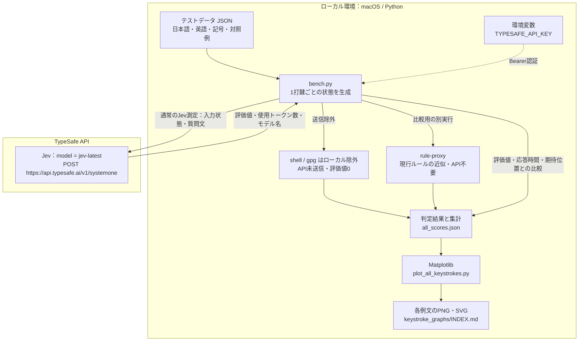

# Issue #187: Jev による自動変換トリガー判定

OpenAI Decisions APIとの比較は、別の [Issue #191ベンチマーク](../decisions_trigger/README.md) で行います。このディレクトリの過去データ・結果は比較の基準として維持します。

## 検証の目的

Sumibiで文章を入力しているときに、TypeSafeのJevを使って「いま日本語変換を始めるべきか」を1打鍵ごとに判断できるかを調べます。日本語は自然な区切りで変換し、入力途中や英語の文章では変換を発動させないことが目的です。現行Sumibiのルールを近似した `rule-proxy` と比較し、判定の精度・応答時間・費用から採用の可能性を検討します。**漢字変換そのものの品質を評価する検証ではなく、製品コードも変更しません。**

## 何を入力して、何を確認するか

日本語のローマ字入力、短い英文・長い英文、記号、数値、コードなど、47ケース・1239打鍵のテストデータを使います。完成した文章を一度に送るのではなく、1文字入力するたびに、その時点のカーソル直前の文字列・最新のキー・入力後の待機時間などをJevに渡します。未来の文字や期待する判定は渡さず、「変換すべきか」の0〜1の評価値を記録します。shell・gpgの2ケースはAPIへ送信せず、ローカルで除外します。

- **日本語の区切りを検出できるか**：`arigatou gozaimasu ` などで、入力途中では待ち、空白・助詞・文末の区切りで評価値が上がるかを確認します。「変換してもよい早めの位置」と「Sumibiにとってより好ましい位置」を区別します。
- **句読点・記号をトリガーにできるか**：日本語の `. , ? !` と全角記号の後に700 ms待った状態を評価し、明示的に変換したい位置を拾えるか確認します。`!` は比較用として測定しましたが、対応は見送りとしています。
- **英語入力中に変換を抑制できるか**：英文15ケースには長文5ケース、複数文、疑問文、小数、短縮形などを含め、空白や句読点の後も含めた全打鍵で「変換しない」ことを確認します。
- **実用的な速度・費用か**：API応答時間と利用トークン数に基づく概算費用を記録し、毎打鍵の判定に使えるかを検討します。

評価値に閾値（暫定値は0.8）を適用して期待する位置と比較し、1例文につき1枚のグラフで入力中の変化を可視化します。各時点は独立に評価するため、途中で実際に変換した後の文字列やカーソルの変化は再現していません。

## 結論のサマリー

**Jevは今回のデータでは英語入力中の変換を抑制し、日本語の区切りを概ね検出できました。変換する基準は評価値0.8以上を暫定値とし、Sumibiへの採用に向けた検証を続けます。**

最新の全件測定は47ケース・1239打鍵、API呼び出し1207回です（2026-10-03、`jev-1.13.0`、質問文 `v2`）。shell・gpgの32打鍵はAPI未送信です。

- **英語の抑制**：英文15ケース・685打鍵で発動0回。長文5件や句読点後の待機も含みます。
- **日本語の変換タイミング**：好ましい28位置中25位置を検出。見逃しは半角 `!` の2位置と `ohayou gozaimasu ` の最後の空白（0.79）です。`!` は利用頻度を踏まえて対応を見送りますが、測定時のラベルは保持しています。
- **早めの変換**：許容できる早めの発動8回、ラベル上は待ちたい位置での発動10回。`arigatou ` のように、変換してもよいが後まで待つほうが好ましい区切りを扱うには、固定閾値だけでは限界があります。
- **応答時間・費用**：応答時間の中央値229.4 ms、95%点359.0 ms、全1207回の費用概算は約0.026米ドル。入力を止めない非同期処理が必要です。

この結果は今回の入力例を独立に判定したものです。全ての英文での抑制や、実際に変換した後の入力操作は保証しません。採用判断には実際のEmacs上での操作性と、早めの発動の扱いを検証する必要があります。製品への組み込みはまだ行っていません。

詳しい解釈は [VISUAL_REPORT.md](VISUAL_REPORT.md)、最新の全例文のグラフは [INDEX.md](keystroke_graphs/INDEX.md)、実測値は [all_scores.json](all_scores.json) を参照してください。

## 計測環境の構成

ローカルのPythonスクリプトでキー入力を再現し、JevにHTTPリクエストを逐次送信します。EmacsやSumibi本体を動かした計測ではありません。



接続先はベンチマーク内の固定エンドポイント `https://api.typesafe.ai/v1/systemone` です。Sumibiの `SUMIBI_AI_BASEURL` や `SUMIBI_AI_API_KEY` は使用せず、`TYPESAFE_API_KEY` で認証します。リクエストでは `jev-latest` を指定し、応答で返る実際のモデル名を記録します（今回の測定では `jev-1.13.0`）。

期待する変換位置のラベルはローカルの集計にのみ使い、APIには送りません。APIの使用トークン数から概算費用を算出します。`rule-proxy` は別の比較実行で、上図のJSONファイル名は全件Jev測定の保存例です。グラフ生成は保存済みJSONを読むだけで、追加のAPI呼び出しはありません。

## まず読む資料

このREADMEは検証の入口と実行手順です。結果を見る場合は、**[グラフ付き結果資料（VISUAL_REPORT.md）](VISUAL_REPORT.md)** を開いてください。

- **結果をグラフで見る** → [VISUAL_REPORT.md](VISUAL_REPORT.md)：全体比較、日本語・英語の1文字ごとの評価値、閾値0.8という暫定判断。
- **全例文の打鍵グラフを見る** → [グラフ一覧（INDEX.md）](keystroke_graphs/INDEX.md)：全47例の1文字ごとの評価値を、1例文1グラフで掲載。
- **要点だけ読む** → [SUMMARY.md](SUMMARY.md)：調査結果の短いサマリー。
- **検証を再実行する** → このREADMEの「[実行手順](#実行手順)」：APIキーの設定、測定、グラフ生成。
- **集計の詳細を確認する** → [NATURAL_RESULTS.md](NATURAL_RESULTS.md)：最初の自然文セットの実測記録。

結果の解釈はVISUAL_REPORT、操作方法はREADMEに分けています。

## データと過去の測定

- [punctuation_cases.json](punctuation_cases.json) は日本語の記号トリガー9件・167打鍵です。半角 `. , ! ?` と全角 `。 、 ！ ？` を含み、各記号入力後に700 ms待った時点を好ましい変換位置としています。現ブランチのSumibiの明示トリガーは半角 `. , ?` のため、`!` と全角は期待動作を広げた検証です。質問文v2を変更せず実測済みで、結果は [VISUAL_REPORT.md](VISUAL_REPORT.md) に掲載しています。`!` の対応は見送りますが、測定時のラベルは保持しています。

現行の `--dataset all` は47ケース・1239打鍵、API呼び出し上限は1207回です。

- 現行の [cases.json](cases.json) と [additional_cases.json](additional_cases.json) は、自然な完全文を中心に差し替えた23ケース・387打鍵です。各日本語例に意図する表記を `japanese` として記録しています。[english_cases.json](english_cases.json) は英文15件・685打鍵で、全打鍵を「変換しない」とラベル付けした専用セットです。既存10件に83〜92文字の長文5件（445打鍵）を追加しました。計38ケース・1072打鍵です。
- 初回実験に使ったデータは [legacy_cases.json](legacy_cases.json) と [legacy_additional_cases.json](legacy_additional_cases.json) に保存しました。不自然な日本語や文脈のない断片を含むため、[旧結果](RESULTS.md)を新データの精度として引用しないでください。
- 全体集計は長文・記号セット追加前の33ケースに基づきます。Jev は英文10ケースで発動0回、好ましい日本語の位置14件をすべて検出しました（閾値0.8）。追加長文5件のうち1件（91打鍵）は実測済み、残り4件は未実測です。全体集計と追加測定は結果資料で区別しています。

## ラベルの意味

`trigger_after` は「この n 番目のキー入力後に変換するのが好ましい」位置（1始まり）、`acceptable_after` は「そこで変換してもよいが後まで待つほうが好ましい」位置です。どちらにもない場所での変換は望ましくありません。句読点は `pause_after_ms` が 500 ms 以上なら、その時間経過後を判定点とします。未来の文字や正解ラベルは Jev に送りません。

`arigatou gozaimasu ` では、最初の空白で変換しても許容できますが、最後の空白まで待つほうがSumibiには好ましい、という入力者の基準を使っています。助詞後のスペースも許容点として示したケースがありますが、自然な文での実測後に注釈を再確認します。

## 実行手順

ベンチマークはPython標準ライブラリで動作します。グラフ生成にはMatplotlibが必要です。コマンドはSumibi作業ツリーのルートから実行します。

### ローカル検証

```sh
python3 benchmark/jev_trigger/bench.py --backend rule-proxy --dataset all
python3 -m unittest discover -s benchmark/jev_trigger -p 'test_*.py'
```

### APIキーを最初に一度だけ設定

Jev 実測にはTypeSafeのAPIキーが必要です。同じターミナルでは、以下を最初に一度実行すれば後続の測定で再入力は不要です。キーをチャット、リポジトリ、コマンド引数、結果ファイルに書かないでください。

```zsh
read -rs "TYPESAFE_API_KEY?TypeSafe API key: "; echo
export TYPESAFE_API_KEY
```

### 全件測定

`--max-calls` は有料API呼び出しの上限で、指定しない実行は拒否します。全件には1207回が必要です（1239打鍵から `shell` 11打鍵と `gpg` 21打鍵をローカル除外）。初回は少数で接続を確認してください。

```sh
python3 benchmark/jev_trigger/bench.py --backend jev --prompt-version v2 --dataset all --max-calls 1207 --include-rows
```

### 日本語の記号と英語長文の測定・グラフ生成

次の測定は日本語記号9件と英文長文1件だけを実行し、各打鍵の値を保存します。既存の集計グラフには自動で加算しません。再測定すると同名の結果ファイルを上書きするので、以前の測定を残す場合は出力名を変えてください。

```sh
python3 benchmark/jev_trigger/bench.py --backend jev --prompt-version v2 --dataset punctuation --max-calls 167 --include-rows > benchmark/jev_trigger/punctuation_scores.json
python3 benchmark/jev_trigger/bench.py --backend jev --prompt-version v2 --dataset english --case-id english_long_report --max-calls 91 --include-rows > benchmark/jev_trigger/english_long_scores.json
```

保存済みの結果からグラフだけを生成する場合、APIキーも追加料金も不要です。

```sh
python3 benchmark/jev_trigger/plot_keystrokes.py benchmark/jev_trigger/punctuation_scores.json --case-id jp_punctuation_sequence
python3 benchmark/jev_trigger/plot_keystrokes.py benchmark/jev_trigger/english_long_scores.json --case-id english_long_report
python3 benchmark/jev_trigger/plot_keystrokes.py benchmark/jev_trigger/greeting_scores.json
python3 benchmark/jev_trigger/plot_results.py
```

PNGとSVGを生成します。長文の打鍵グラフは1枚の中で32打鍵ごとに段を分けます。`plot_results.py` は保存済みの集計値 `plot_data.json` を描画し、新しい測定を自動集計するものではありません。

### 全例文を1例文1グラフにする

APIキー設定済みのターミナルで以下を実行します。最大1207回のAPI呼び出しで全打鍵の評価値を保存し、47ケースのPNG・SVGと閲覧用の一覧を生成します。出力ファイルが既にある場合は別名にして過去の測定を保管してください。

```sh
python3 benchmark/jev_trigger/bench.py --backend jev --prompt-version v2 --dataset all --max-calls 1207 --include-rows > benchmark/jev_trigger/all_scores.json
python3 benchmark/jev_trigger/plot_all_keystrokes.py benchmark/jev_trigger/all_scores.json
```

結果は [グラフ一覧（keystroke_graphs/INDEX.md）](keystroke_graphs/INDEX.md) から閲覧できます。描画コマンドはAPIを呼び出しません。shell/gpgの2ケースはAPI送信を避け、グラフにも「ローカル除外・API未測定」と表示します。

### 作業終了時

全ての測定を終えたときだけキーを解除します。ターミナルを閉じた場合も設定は引き継がれません。

```sh
unset TYPESAFE_API_KEY
```

通信は逐次実行し、エラー時は停止します。途中で止まった場合は `--start-row N` で再開できますが、分割された実行の p50/p95 は個々の遅延値なしには正確に合算できません。価格表示は [TypeSafe の公表入力単価](https://typesafe.ai/blog/introducing-system-one-models-and-jev)による概算で、実請求額は管理画面で確認してください。API形式は[公式 Quick start](https://docs.typesafe.ai/introduction/quickstart)と[Noul 仕様](https://docs.typesafe.ai/primitives/noul)に準拠します。

## 結果の読み方と限界

`overall`、`by_group`、`threshold_sweep` は好ましい位置だけを正例とした厳密な二値指標です。許容できる早めの変換もその FP に含まれるため、FP をそのまま「不正解」と呼ばないでください。`preference_summary`、`acceptable_but_nonpreferred`、`unwanted_triggers` で三段階に分けます。`positive_scores` は好ましい位置、`acceptable_scores` は許容位置の確率です。

英語専用セットは全て負例のため、precision / recall より `english_safety` を見てください。`false_triggers` は打鍵単位の発火回数、`cases_with_trigger` は一度でも発火した英文の件数です。`--dataset all` でもこの指標は英語専用セット15件を対象にします。目標は両方0ですが、15件だけで安全性を証明するものではありません。追加長文5件だけを測定する場合は `--dataset english --start-row 241 --max-calls 445 --include-rows` を指定できます。

`rule-proxy` は Lisp 本体の完全な移植ではありません。また各打鍵を独立に評価するため、途中で変換した後の文字列やカーソル位置は再現しません。採用前には実際のEmacsフック、入力操作全体、非同期処理、API停止時の動作を検証します。
