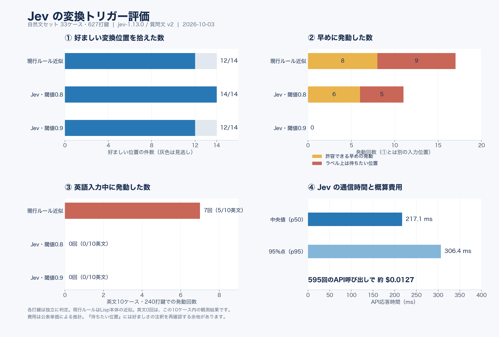
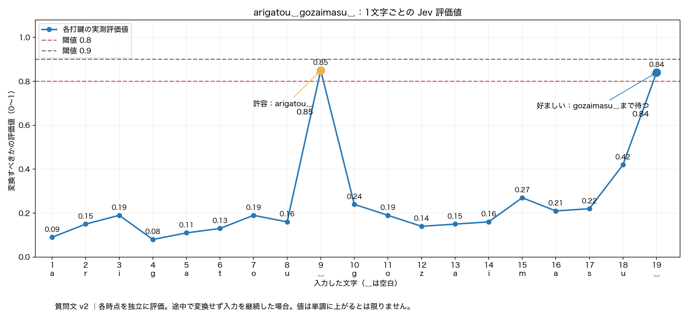
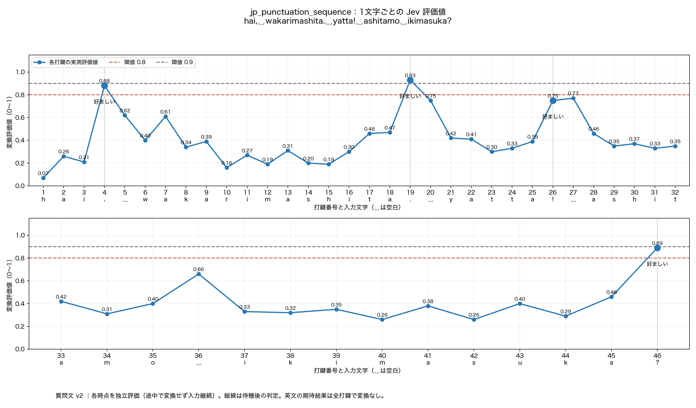
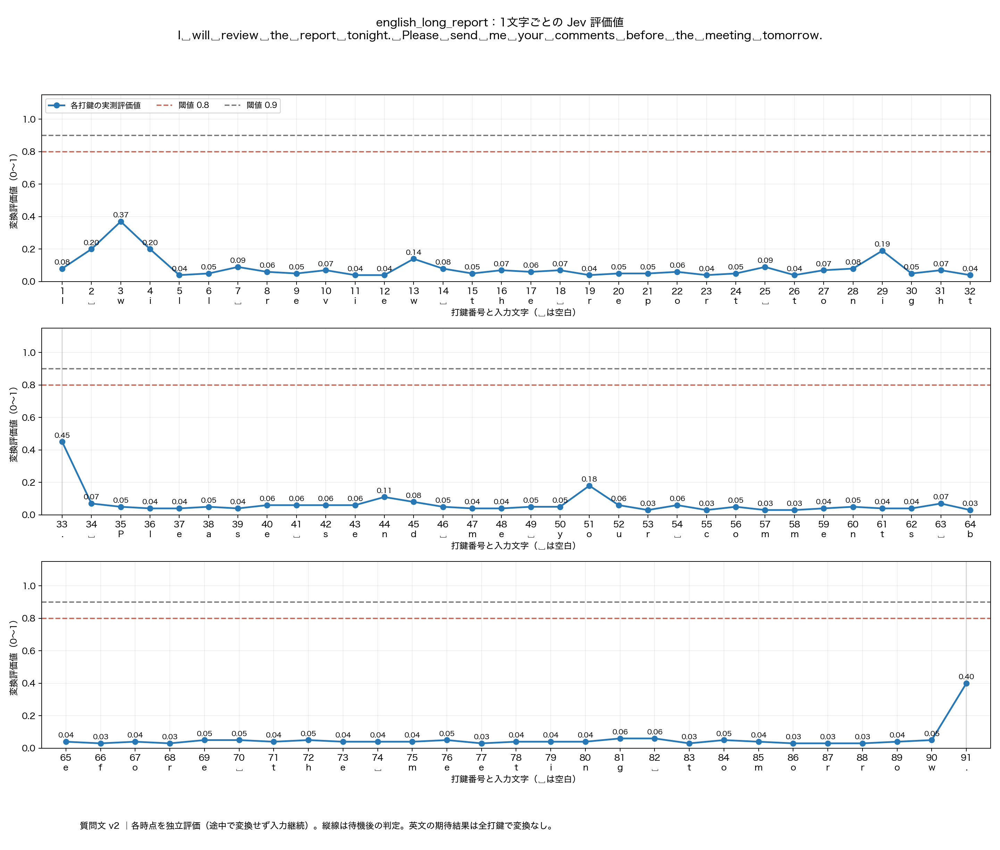

# Jevによる変換トリガー判定 — グラフ付き調査資料

この文書は検証結果とグラフを読むための資料です。データの構成、APIキーの設定、測定・再描画の手順は [README.md](README.md) を参照してください。

2026-10-03 / 自然文33ケース・627打鍵 / `jev-1.13.0` / 質問文 `v2`

追加測定として、日本語の半角・全角記号9件（167打鍵）と英文長文1件（91打鍵）を評価しました。追加した英文長文5件のうち、残り4件は未実測です。追加測定は下の全体集計グラフには含めず、後半の打鍵グラフで示します。



## グラフから分かること

**英語入力中の抑制は、このセットでは良好でした。** 英文10ケース・240打鍵で、Jevは一度も発動しませんでした。現行ルールの近似は7回発動し、5ケースに影響しました。英文の句読点後に待つ場合も評価しています。

**日本語では、拾いやすさと待つタイミングにトレードオフがあります。** 閾値0.8では好ましい位置14件をすべて検出しましたが、許容できる早めの発動が6件、ラベル上は待ちたい位置での発動が5件ありました。閾値0.9ではこれらの早めの発動は0件になり、挨拶の末尾2件を見逃します。

「待ちたい位置」の5件は `hare `、`ame `、`yoroshiku `、`arigatou `、`kaigi ` の後です。これらは日本語の語句の区切りで、すべてを不正解とは断定しません。Sumibiでどこまで入力してから変換するのが好ましいか、という観点で扱います。

**通信を入力操作から切り離す必要があります。** API応答の中央値は217.1 ms、95%点は306.4 ms。全595呼び出しの費用概算は $0.0127 でした。毎打鍵この時間を同期的に待つ構成では、入力の操作感に影響します。

## 1文字ごとの評価値：`arigatou␣gozaimasu␣`



2026-10-03に、この例だけを19回のAPI呼び出しで追加測定しました（`jev-1.13.0`、質問文 `v2`）。`␣` は空白です。上の627打鍵の集計とは別の測定で、集計値は変更していません。

| 入力状態 | 評価値 | Sumibiでの好ましさ |
| --- | ---: | --- |
| `arigatou` | 0.16 | 続けて入力するため待つ |
| `arigatou␣` | 0.85 | 変換してもよいが、後まで待つほうが好ましい |
| `arigatou␣g` | 0.24 | 次の語の入力中なので待つ |
| `arigatou␣gozaimasu` | 0.42 | 最後の空白まで待つ |
| `arigatou␣gozaimasu␣` | 0.84 | 好ましい変換位置 |

評価値は文字数に応じて単調に上がるのではなく、空白で大きく上がり、次の語を入力すると下がりました。閾値0.8では両方の空白で発動し、0.9ではどちらも発動しません。この測定では早めの許容位置（0.85）が好ましい末尾（0.84）より高いため、固定閾値だけで「gozaimasuまで待つ」を選び分けることはできません。

途中で実際に変換せず、同じローマ字列の入力を続けた各時点を独立に評価しています。前回の全体測定では両空白とも0.86で、今回の値とは小さな差があります。今回の1回の測定から、この差の原因や再現性は判断できません。

実測値は [greeting_scores.json](greeting_scores.json)、拡大用は [SVG版](greeting_thanks_keystrokes.svg)です。再描画はAPIを呼び出しません。

```sh
python3 benchmark/jev_trigger/plot_keystrokes.py benchmark/jev_trigger/greeting_scores.json
```

## 日本語の記号：1文字ごとの評価値



入力例は `hai, wakarimashita. yatta! ashitamo ikimasuka?`（はい、わかりました。やった！明日も行きますか？）です。各記号の後に700 ms待機し、変換を期待する時点を「好ましい」と表示しています。2026-10-03、`jev-1.13.0`・質問文 `v2` で測定しました。

| 記号入力後の状態 | 評価値 | 閾値0.8での判定 |
| --- | ---: | --- |
| `hai,` | 0.88 | 変換する |
| `hai, wakarimashita.` | 0.93 | 変換する |
| `hai, wakarimashita. yatta!` | 0.75 | 変換しない |
| `hai, wakarimashita. yatta! ashitamo ikimasuka?` | 0.89 | 変換する |

この例では読点・句点・疑問符で期待する変換を拾えました。`!` は閾値未満ですが、利用者の判断により対応は見送ります。グラフの「好ましい」は測定時の期待ラベルを保持しているため、`!` にも残しています。

記号セット全9件では、当初ラベルの14位置中12位置を検出し、見逃した2位置はいずれも半角 `!` でした。全角 `！` の単独例は0.81でした。また、記号以外の空白で4回発動しています。`!` の見送りを理由に、保存済みのラベルや集計値は変更していません。

実測値は [punctuation_scores.json](punctuation_scores.json)、拡大用は [SVG版](jp_punctuation_sequence_keystrokes.svg)です。

## 英語長文：1文字ごとの評価値



入力例は `I will review the report tonight. Please send me your comments before the meeting tomorrow.` です。全91打鍵で「変換しない」が期待結果です。各文末のピリオド後には700 ms待機しました。

評価値は全打鍵で0.8未満、最大でも0.45でした。句読点後の待機を含め、変換の発動は0回でした。この長文1例では英語入力中の抑制ができていますが、他の長文でも常に抑えられる保証ではありません。

実測値は [english_long_scores.json](english_long_scores.json)、拡大用は [SVG版](english_long_report_keystrokes.svg)です。

## 暫定判断と再描画

変換する基準は、評価値 **0.8以上** を暫定値とします。`!` の対応は見送ります。日本語の `. , ?` と英語長文の抑制を確認できましたが、空白での早めの発動や未測定の英文長文は引き続き確認が必要です。Sumibi本体の実装・設定は変更していません。

以下の再描画はAPIを呼び出しません。

```sh
python3 benchmark/jev_trigger/plot_keystrokes.py benchmark/jev_trigger/punctuation_scores.json --case-id jp_punctuation_sequence
python3 benchmark/jev_trigger/plot_keystrokes.py benchmark/jev_trigger/english_long_scores.json --case-id english_long_report
```

## 評価の範囲

各打鍵の入力状態を独立に判定しており、変換後のカーソルや文字列の変化は再現していません。現行ルールも実際のLisp本体の近似です。英語で0回という結果は全体測定の10ケースと追加測定の長文1ケースに限ります。費用は公表単価からの推計で、実請求額は未確認です。

詳細は [NATURAL_RESULTS.md](NATURAL_RESULTS.md)。拡大・編集用途には [SVG版](jev_benchmark_summary.svg)を使えます。記録した集計値は [plot_data.json](plot_data.json)、再生成用のPythonは [plot_results.py](plot_results.py)です。

```sh
python3 benchmark/jev_trigger/plot_results.py
```

グラフ生成時にAPI呼び出しは行いません。
