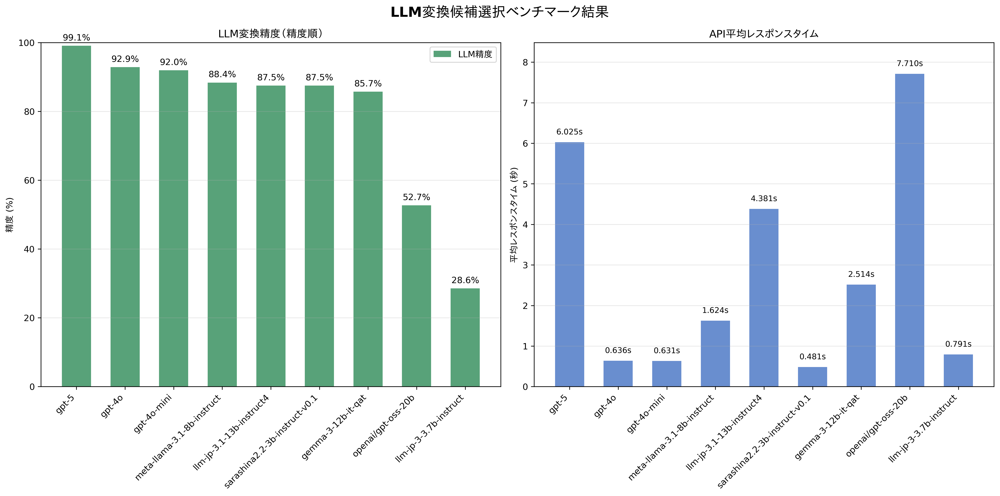
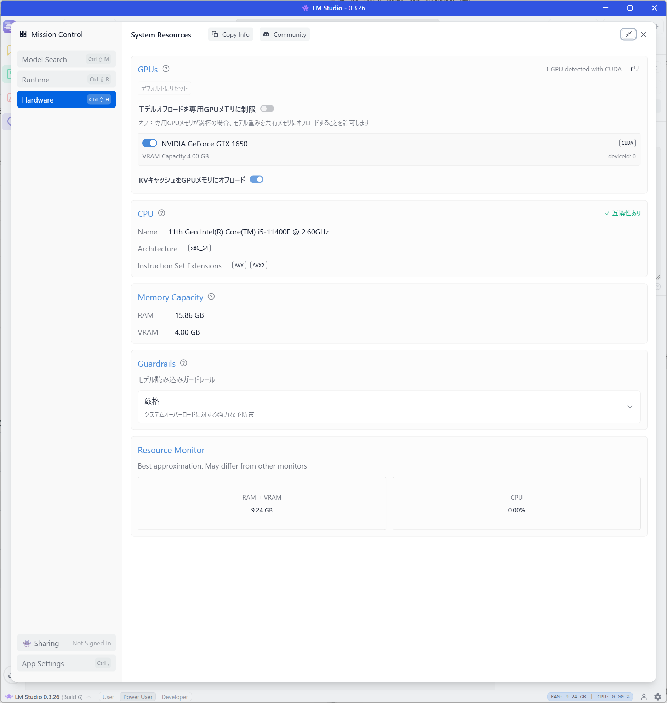

# Mozc Conversion Helper Benchmark

## 概要

このディレクトリは、issue #87 で提案された「LLMを使った Mozc 変換候補の知的選択」のベンチマーク環境です。
現代日本語への適合性を高めるため、Livedoorニュース・コーパスを使用しています。

## 目的

バックエンドが mozc モードの際に、LLM が文脈に最適な変換候補を自動選択できるかを検証します。

## 結果



### ベンチマーク結果サマリー

| モデル | LLM精度 | 平均レスポンス時間 |
|-------|---------|-------------------|
| gpt-5 | 99.1% | 6.025s |
| gpt-4o | 92.9% | 0.636s |
| gpt-4o-mini | 92.0% | 0.631s |
| meta-llama-3.1-8b-instruct | 88.4% | 1.624s |
| llm-jp-3.1-13b-instruct4 | 87.5% | 4.381s |
| sarashina2.2-3b-instruct-v0.1 | 87.5% | 0.481s |
| gemma-3-12b-it-qat | 85.7% | 2.514s |
| openai/gpt-oss-20b | 52.7% | 7.710s |
| llm-jp-3-3.7b-instruct | 28.6% | 0.791s |

### ローカルLLMの評価と推奨モデル

**総合評価（レスポンス時間重視）:**

1. **最適ローカルLLM: sarashina2.2-3b-instruct-v0.1**
   - 精度: 87.5%（十分高い精度）
   - 応答時間: 0.481s（最高速・実用的）
   - **リアルタイム入力に最適な高速応答**

2. **バランス重視: meta-llama-3.1-8b-instruct**
   - 精度: 88.4%（ローカルLLM中最高）
   - 応答時間: 1.624s（許容範囲内）
   - 精度を優先し、多少の待機時間を許容できる場合

3. **サブ選択肢: gemma-3-12b-it-qat**
   - 精度: 85.7%（実用レベル）
   - 応答時間: 2.514s（やや遅い）
   - 中程度の選択肢として検討可能

**推奨しないモデル:**
- `llm-jp-3.1-13b-instruct4`: 応答時間4.381sは実用的でない
- `openai/gpt-oss-20b`: 精度52.7%と応答時間7.710sの両方が劣悪
- `llm-jp-3-3.7b-instruct`: 精度28.6%と極めて低い

**結論:**
レスポンス時間を重視する場合、ローカルLLMでSumibiの変換候補選択に最も適しているのは **sarashina2.2-3b-instruct-v0.1** です。
0.481sの高速応答により、リアルタイムな日本語入力でストレスを感じることなく使用できます。

## 計測に使用したハードウェア

ML Studioを使用した。スペックは以下の通り。




## ベンチマーク作成手順（Livedoor ニュース）

1. 事前準備: Livedoor ニュースコーパス（LDCC）を入手・展開
   - 例: `./external/LDCC/text/...` にカテゴリ別の `.txt` が並ぶ状態
2. プレーンテキスト化: 記事を1行テキストに整形
   - `python3 scripts/prepare_livedoor.py ./external/LDCC/text`
   - 出力: `data/corpus/livedoor.txt`
3. パターン抽出: `python3 scripts/extract_patterns_from_corpus.py`
   - `data/corpus/*.txt` を自動検出し、`extracted_pattern_code.txt` を生成
4. 正解データ作成: `python3 scripts/create_ground_truth_data.py`
   - `ground_truth_data.json` を生成
5. テストケース検証: `python3 scripts/test_embedded_cases.py`
6. ベンチマーク実行: `export OPENAI_API_KEY=... && make run-benchmark`

## ディレクトリ構成

- `data/` - Livedoor 抽出済みプレーンテキスト（`data/corpus/livedoor.txt` など）
- `scripts/` - データ処理・ベンチマーク実行スクリプト
- `results/` - ベンチマーク結果
- `mozc_helper/` - Mozc 変換候補シミュレーションモジュール

## ベンチマーク実行手順

### 1. 基本的な実行

```bash
# OpenAI APIキーを設定
export OPENAI_API_KEY="your-api-key"

# デフォルト（gpt-5）でベンチマーク実行
make run-benchmark
```

### 2. モデルの切り替え

```bash
# gpt-4o-miniを使用
export OPENAI_MODEL="gpt-4o-mini"
make run-benchmark

# gpt-4を使用
export OPENAI_MODEL="gpt-4"
make run-benchmark

# ローカルLLM（LM Studio等）を使用
export OPENAI_API_KEY="dummy"
export OPENAI_BASEURL="http://192.168.56.1:1234/"
export OPENAI_MODEL="openai/gpt-oss-20b"
make run-benchmark
```

### 3. 結果の確認とグラフ化

```bash
# ベンチマーク結果をグラフで表示
make plot-results

# 個別の結果ファイルを確認
ls results/
# gpt-5.json, openai--gpt-oss-20b.json など
```
### 4. 結果ファイル

- `results/{model}.json`: 各モデルの詳細結果
- `benchmark_comparison.png`: モデル比較グラフ

## 環境要件

- Python 3.8+
- OpenAI API（LLM 用）
- Livedoorニュース・コーパス

## 注意点
- 旧仮名/旧字体など歴史的表記に引きずられないよう、現代表記を使うコーパス(Livedoorニュース)を使っています。
